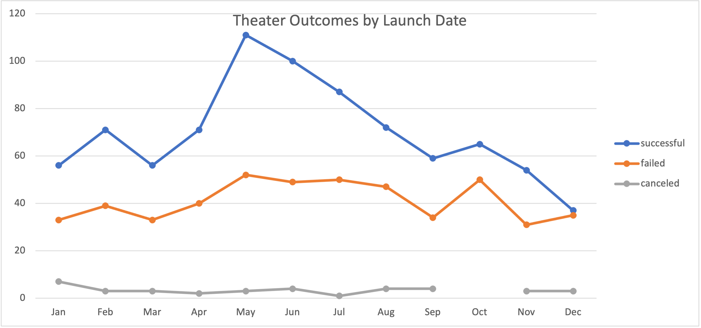

# An Analysis of Kickstarter Campaigns
### Purpose

##### 
To perform an analysis over Kickstarter data to identify outcome trends based on launch dates and goals.  

### Background

##### 
Kickstarter dataset lists the campaign name, along with other pertinent information such as launch date, and category and subcategory. It also includes a goal column, which shows how much money each campaign needs to be successful, a pledged column, which shows how much each campaign made, and an outcome column, which shows if the campaign met the goal.  

Before analyzing the data, additional columns were added to the file. They include the following:

1.	Date Created Conversion: As launch dates are shown in Unix Timestamps, a new column with the above heading was added to the file to convert the data to readable date format using the formula = (((J2/60)/60)/24)+DATE(1970,1,1).

2.	Parent Category and Subcategory: As the category and subcategory information was shown in one column, two new columns with the above headings were added to the file to separate the data into the corresponding categories using the “Text to Columns” button. 

3.	Years: This column was added to show the launch year using the formula Year(J2). 

### Analysis

##### 
The first analysis focused on the theater outcomes by launch date. A pivot table along with a line chart were created to show the correlation between the outcomes (i.e. successful, failed, and canceled) and the month in which the campaign was launched. Filters and sorts were done in the pivot table, which updated the line chart automatically, and easily allowed specific data to be presented. 

The second analysis focused on the outcomes for plays based on goals. For this analysis, additional calculations were performed. The goal amount was broken out into different tiers, for example, “Less than 1000”, “1000 to 4999”, “5000 to 9999”, etc. The formula “COUNTIFS” was used to determine the number of successful, failed and canceled campaigns for each corresponding tier. Total campaigns were added based on tier and then the percentage of successful, failed and canceled campaigns was calculated for each tier. A line chart was created to show the correlation between outcomes and goals. The challenge for this part of the analysis included a.) ensuring that tier amounts were correctly shown in the COUNTIFS formula, and b.) that formulas were copied and updated correctly, as needed, from cell to cell.  

### Results

#####
From the “Theater Outcomes by Launch Date’ line chart, the largest number of successful campaigns were launched in the months of May, June and July and the least number of successful campaigns were launched in December. The number of failed campaigns remained constant throughout the months, fluctuating between 31 to 52. 

From the “Outcomes Based on Goal” line chart, the highest percentage of successful outcomes occurred for plays with goals set below $1,000. 

In both analyses, the data presented is not sufficient to understand how successful campaigns were. For example, in the first analysis, although the largest number of successful campaigns were launched in May, June and July, it is not clear from the line chart how successful those campaigns were in comparison to campaigns launched in other months. To analyze further how successful campaigns were, a high-low line chart can be used to show the difference between the goal and pledged amount. 
